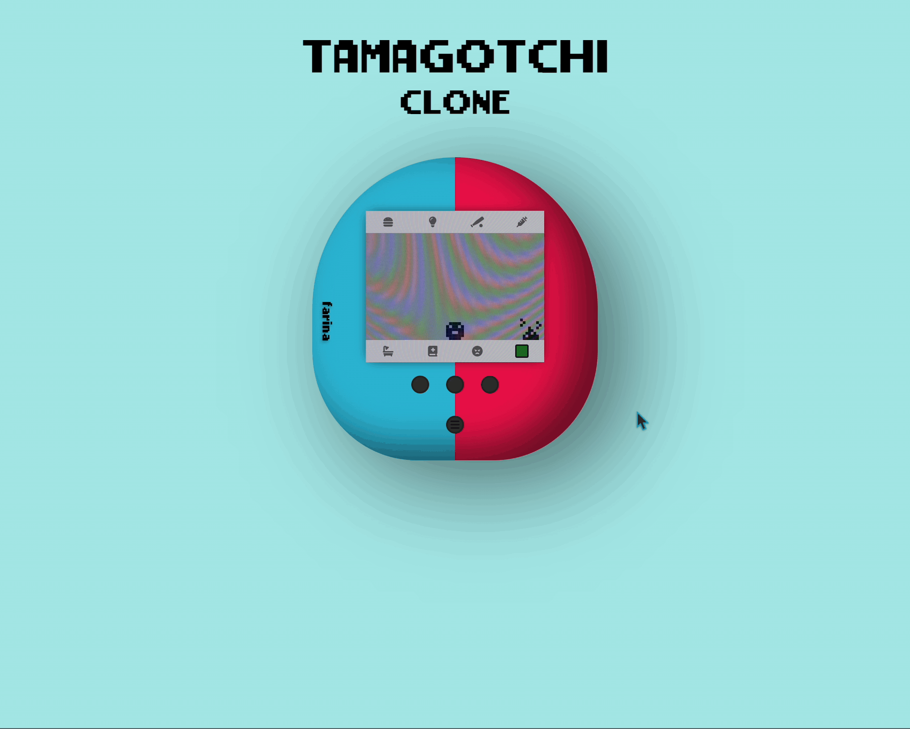
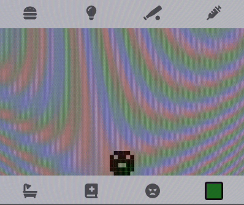
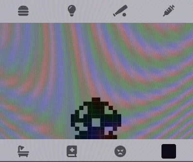
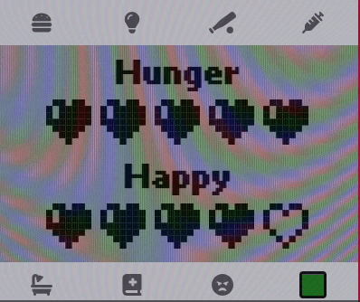
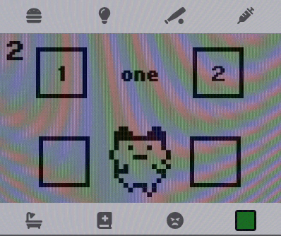
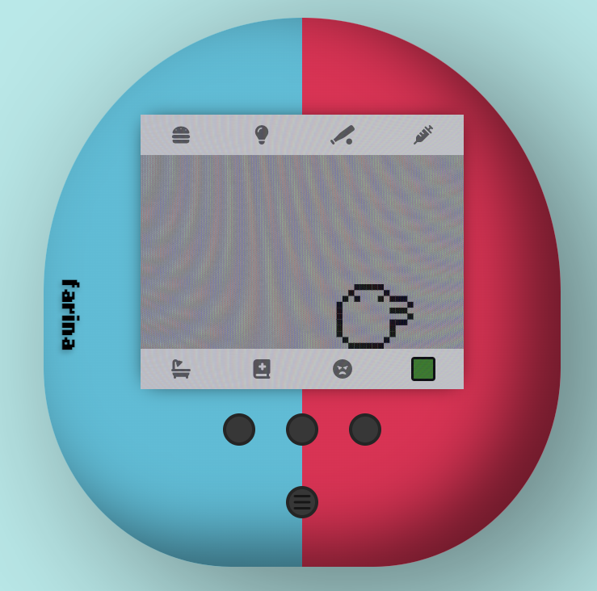
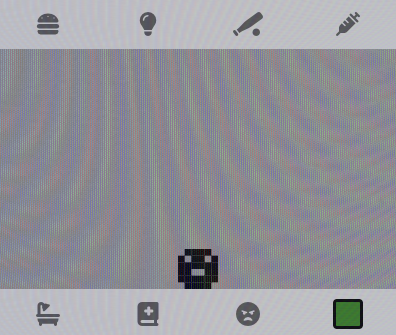
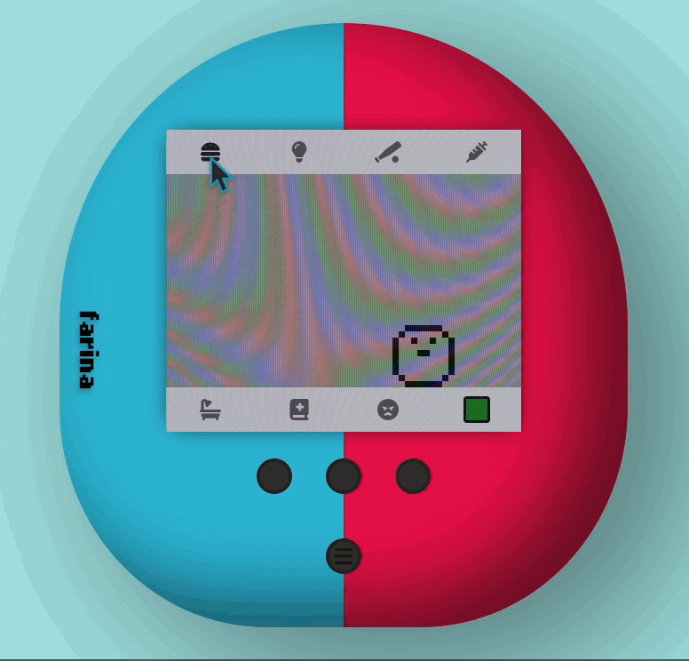
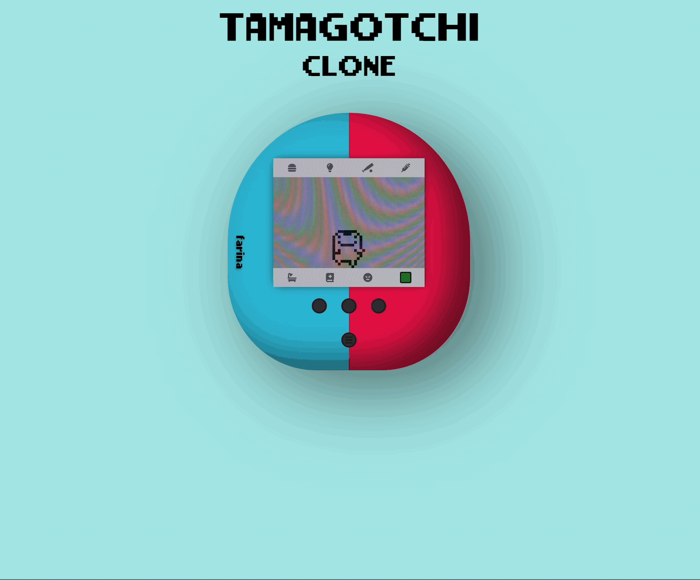

<!-- PROJECT LOGO -->
 

<h1 align="center">Tamagotchi</h1>

  

   A recreation of the classic tamgotchi created with Vanilla JS
     
    <a href="https://tamagotchi.johnfarina.co">View Live Demo</a>

<!-- TABLE OF CONTENTS -->

  
Table of Contents

  <ol>
    <li>
      <a href="#about-the-project">About The Project</a>
      <ul>
        <li><a href="#built-with">Built With</a></li>
      </ul>
    </li>
    <li>
      <a href="#javascript">JavaScript</a>
      <ul>
        <li><a href="#state">State</a></li>
        <li><a href="#dom">DOM</a></li>
        <li><a href="#updating-game--animations">Updating Game & Animations</a></li>
      </ul>
    </li>
    <li>
      <a href="#tamagotchi-game-logic">Tamagotchi Game Logic</a>
      <ul>
        <li><a href="#time-oriented--random">Time Oriented & Random</a></li>
        <li><a href="#evolution-states">Evolution States</a></li>
        <ul>
            <li><a href="#baby--toddler">Baby & Toddler</a></li>
            <li><a href="#teens">Teens</a></li>
            <li><a href="#adults">Adults</a></li>
        </ul>
        <li><a href="#healthhappy-degeneration">Health/Happy Degeneration</a></li>
        <li><a href="#guessing-game">Guessing Game</a></li>
      </ul>
    </li>
    <li>
      <a href="#design">Design</a>
      <ul>
        <li><a href="#characters">Characters</a></li>
        <li><a href="#the-device">The Device</a></li>
        <ul>
            <li><a href="#screen">Screen</a></li>
            <li><a href="#menus">Menus</a></li>
            <li><a href="#themes">Themes</a></li>
        </ul>
      </ul>
    </li>
    <li><a href="#usage">Usage</a></li>
    <li><a href="#contact">Contact</a></li>
  </ol>

<!-- ABOUT THE PROJECT -->
## About The Project
This Tamagotchi project is a digital recreation of the classic virtual pet. Built with Vanilla JavaScript and CSS, I tried to capture the essence of the original while adding to the web experience. With this project, you can take care of your Tamagotchi by feeding, playing, and healing it. Get ready to relive the traumatic experiences of taking care of the Tamagotchi but all on the web!

### Built With
 - JavaScript
 - CSS & HTML

## JavaScript

### State
I used a single `gameState` object to run the game to make it easier if I wanted to make a saving functionality for the future, and to keep the code clean and easily changeable. The state object stores things like, screenState, gameState, Tamagotchi Health, and more.

### DOM
In this project I am manipulating the DOM objects I have already placed in the HTML, showing and hiding the correct images that correlate with the state I used this method to keep track of the images and what images go in what screens.

### Updating Game & Animations
For updating the game and animations I am using two `setIntervals` that are both updating on their own interval, for the game interval it is set at a higher pace because I want it to be fluent and not feel laggy, but I did the opposite for the animation frame because **I do** want the animations to be choppy, to try to go for the classic Tamagotchi style.

(<a href="#readme-top">back to top</a>)

## Tamagotchi Game Logic

### Time Oriented & Random
The core mechanics of Tamagotchi are centered around the use of time and randomness. These elements are used to create a unique and unpredictable experience for the player. For instance, the Tamagotchi's evolution is determined by both time and random chance. The game state is updated with the current time each time the Tamagotchi evolves, and the value is compared with the start time of the game. When the preferred time for evolution is reached, the game uses a random percent generation function to determine the specific outcome of the evolution, adding an element of surprise and replayability for each aspect of the game.

(<a href="#readme-top">back to top</a>)

### Evolution States
I am controlling the evolution using an Array with all the values, there are 4 main Evolution states. Baby, Toddler, Teen, Adult.
#### **Baby & Toddler**
For the baby and toddler there is only one character, but this is where all characters can evolve from. Each player gets the same baby and toddler then they will receive a random teen based on how happy it is.

#### **Teens**
There are two teens a player can get there Tamagotchi to evolve into they both act the same, but have different looks.

#### **Adults**
There are 6 different adults *(I designed one myself)* so there are many chances to get a unique character. The gameplay is all the same and looks are only aesthetic. *(Some characters in the original Tamagotchi get more sick, etc.)*

(<a href="#readme-top">back to top</a>)

### Health/Happy Degeneration
Both health and happy degeneration are based off a 3% chance, and it runs every 10 seconds or so. If the value is true then the Tamagotchi's health or happiness degenerates, The user can then feed the Tamagotchi or play with it to increase their health.  
All other random Tamaogtchi generations are following the same rules but with a higher or lower percentage depending on what it is. For example random Pooping can get turned into a higher chance if the Tamagotchi is sick for a set amount of seconds/minutes.

(<a href="#readme-top">back to top</a>)

### Guessing Game
The guessing game was inspired by the original game on the Tamagotchi itself, where you have to guess what direction the Tamagotchi is going to be facing. This is the only part of the game I tweaked for the web experience. Making it so you can click the screen instead of having to click the buttons on the device.  
For the game I am generating a random number 1 or 2, and each button correlates with your guess, if you guessed the same number then the round continues and you get a point, the first one to 3 points wins. If you loose against the Tamagotchi it won't make it happy. But if you win the Tamagotchi will get happy.

(<a href="#readme-top">back to top</a>)

## Design

### Characters
I recreated the original Tamagotchi characters in an SVG form so it's better for the web and I could resize them when needed. This was a long process of finding videos of every Tamagotchi character since it was hard for me to get each one on my actual Tamagotchi. *(the ending gravestone scene when your Tamagotchi dies is actually from a discontinued version of the actual Tamagotchi. They then replaced that with the character growing wings.)*  
Here are most of the images I created.

    
    
    
    
    
    
    
    
    
    
    

(<a href="#readme-top">back to top</a>)

### The Device
The device was created rounding a div to get that egg shape that a Tamagotchi usually is. I tried creating mostly everything about the device in pure CSS and HTML, using divs and shaping them as needed.

 

#### **Screen**
For the screen I added a screen texture over the div using `z-index` to finalize the retro effect and to make it more accurate.

 

#### **Menus**
Each menu I made was inspired directly from the menus created for the original Tamagotchi, I did change some aspects to make it better for the web but it's mostly the same as the original Tamagotchi is.

 

#### **Themes**
I created custom themes because that is an important part of Tamagotchi experience which is customization the basic themes are inspired directly from the color schemes used for Tamagotchi's.

I did add some of my own custom ones to test what I could do, for the red and blue default color it was done using a CSS gradient on the div object. And for the Futurama and ALF one I created using color schemes from the show and added a logo.

(<a href="#readme-top">back to top</a>)

<!-- USAGE EXAMPLES -->
## Usage
To use the Tamagotchi, open the site and wait for your Tamagotchi to hatch. Once it's born, make sure to keep it healthy and happy by feeding it regularly and playing games with it. It's important to clean your Tamagotchi after it poops and heal it when it becomes sick. As an owner, you can observe your Tamagotchi's growth and see what kind of Tamagotchi it will become. The goal is to extend its lifespan by providing the best possible care.

## What I Would Do If I Had More Time.
If I had more time to work on this project I would add a saving functionality either with local storage or using rails as a database.  
I would then work on making the game last for days and not hours, Because then the user can close and save their progress.
And I could add stuff that happens depending on the last time you were online.  
I would also like to add more themes and maybe a make your own themes using a color dial.

<!-- CONTACT -->
## Contact

**John Farina** - johnfarina8@gmail.com

My Website: [johnfarina.co](https://johnfarina.co)

Project Link: [github.com/john-farina/myTamagotchi](https://github.com/john-farina/myTamagotchi)

(<a href="#readme-top">back to top</a>)

